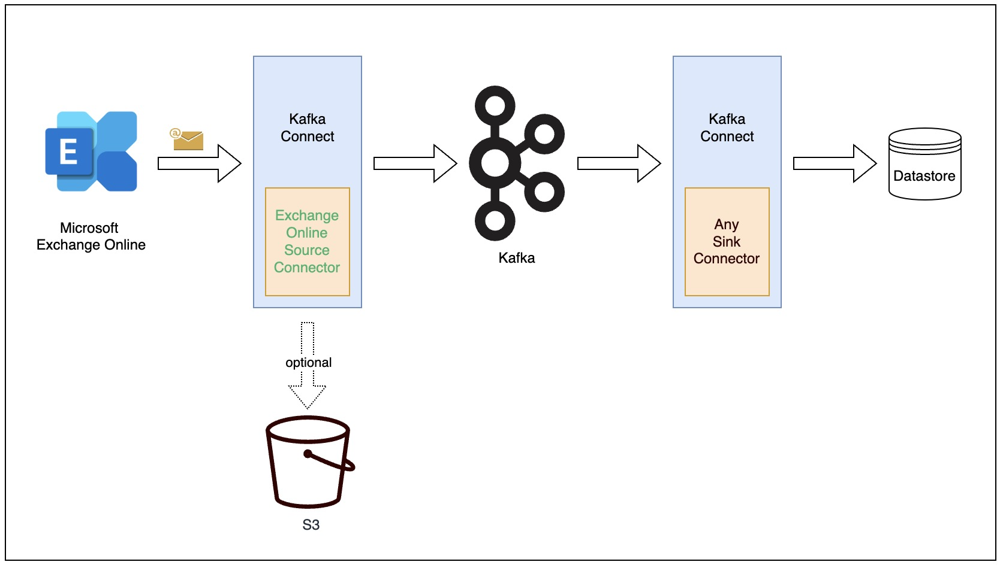

# Kafka Connector for Microsoft Exchange Online

This Kafka _source_ connector seamlessly integrates Microsoft Exchange Online (M365) mailboxes with
Kafka, by leveraging the Microsoft Graph API to fetch emails and publish them to Kafka topics. This
enables real-time email processing, making it an essential component for organizations looking to
streamline their email data workflows.

## Contents

- [Overview](#overview)
- [Features](#features)
  - [At least once delivery](#at-least-once-delivery)
  - [Supports multiple tasks](#supports-multiple-tasks)
  - [Microsoft Exchange Online resources](#microsoft-exchange-online-resources)
- [Limitations](#limitations)
- [Use cases](#use-cases)
  - [Email Semantic Search](./use-case-semantic-search.md)
  - [Email Archiving](./use-case-semantic-search.md)
  - [Knowledge Graph](./use-case-semantic-search.md)
  - [Customer Engagement Metrics](./use-case-semantic-search.md)
- [Prerequisite](#prerequisite)
- [Installation](#installation)
- [Configuration](#configuration)
- [Examples](#examples)
  - [Minimal Configuration](#minimal-configuration)
  - [Multiple Mailboxes](#multiple-mailboxes)
  - [JSON/AVRO Encoding](#json-encoding)
- [Error handling](#error-handling)
- [Logging and tracking](#logging-and-tracking)
- [License](#license)
- [Support](#support)

## Overview

Exchange Online Connector is a source connector capturing emails from Microsoft Exchange Online and publishing them to Kafka topics. The connector can be used to build real-time email processing applications like email archiving, semantic search and knowledge graphs.

The connector uses Microsoft Graph API to fetch emails from the configured mailboxes. The connector can scale up horizontally by running multiple tasks to fetch emails from multiple mailboxes, one task per mailbox. The connector can optionally be configured to save the raw emails to S3 in mime format.



## Features

The Microsoft Exchange Online Source connector offers the following features:

- [At least once delivery](#at-least-once-delivery)
- [Supports multiple tasks](#supports-multiple-tasks)
- [Microsoft Exchange Online Resources](#microsoft-exchange-online-resources)

#### At least once delivery

This connector guarantees that emails are delivered to the Kafka topic at least once. If the
connector restarts, there may be some duplicate records in the Kafka topic.

#### Supports multiple tasks

The connector supports running one or more tasks. More tasks may improve performance. One mailbox is covered by one task only.

#### Microsoft Exchange Online resources

The connector supports fetching the following resources:

- **emails**: Emails from a Exchange Online
  mailbox.

## Limitations

- Only Emails are supported from Exchange Online.
- Email body is limited to 1MB.

## Use cases

Following are some of the use cases where this connector can be useful:

- [Email Semantic Search](./use-case-semantic-search.md)
- [Email Archiving](./use-case-semantic-search.md)
- [Knowledge Graph](./use-case-semantic-search.md)
- [Customer Engagement Metrics](./use-case-semantic-search.md)

## Prerequisite

- Confluent Platform or Apache Kafka with connect
- Azure AD Application with access to Exchange online.

  Here are the [instructions](./azure-ad-app-setup.md) to setup Azure AD App if you have not got one already.

## Installation

The connector is distributed in two versions:

- Confluent Platform® and Confluent Cloud®.

  This package can be deployed to Confluent Platform as a self-managed connector, and to Confluent Cloud as a custom connector.

  The package is available for download from [Confluent Connector Hub](https://www.confluent.io/hub/TBD) or [releases](https://github.com/inoxis-labs/exchangeonline-source-connector/releases). Here are the installation instructions:

  - [Confluent Platform](./cplatform.md)
  - [Confluent Cloud](./ccloud.md)

- Apache Kafka

  This package is available for platforms built on the open-source software (OSS) Apache Kafka®, including Amazon MSK®.

  For standalone Kafka Connect installations, [download](https://github.com/inoxis-labs/exchangeonline-source-connector/releases) the self-contained JAR file and copy it into the plugins directory for each of your Kafka Connect cluster members.

## Configuration

In addition to the common Kafka
Connect [source-related](https://kafka.apache.org/documentation.html#sourceconnectconfigs)
configuration options, this connector defines the following configuration properties.

| Property                                | Required | Default  | Description                                                                                                                                                                                                                       |
| --------------------------------------- | -------- | -------- | --------------------------------------------------------------------------------------------------------------------------------------------------------------------------------------------------------------------------------- |
| `kafka.topic`                           | **Yes**  |          | Kafka topic to publish the emails to.                                                                                                                                                                                             |
| `tasks.max`                             | **Yes**  | 1        | Maximum number of tasks to use for this connector. To achieve maximum throughput, set this to the same number as the mailboxes configured to monitor.                                                                             |
| `email.mailboxes`                       | **Yes**  |          | List of mailboxes to monitor, separated by comma. Example: `a@sample.com,b@sample.com`                                                                                                                                            |
| `email.new.offset`                      | **Yes**  | earliest | Possible values are earliest and latest. This setting is used when the mailbox is being monitored for the first time. `earliest` - fetches emails from the oldest email in the mailbox. `latest` - fetches from current timestamp |
| `exchangeonline.tenant.id`              | **Yes**  |          | Azure App's Tenant ID (Instructions for setting up the app can be found in Azure-AD-App-Setup-Instructions.docx.                                                                                                                  |
| `exchangeonline.client.id`              | **Yes**  |          | Azure App's Client ID.                                                                                                                                                                                                            |
| `exchangeonline.client.secret`          | **Yes**  |          | Azure App's secret.                                                                                                                                                                                                               |
| `email.repository.enabled`              | **Yes**  | `false`  | This enables saving of raw emails(in mime format, .eml) to S3.                                                                                                                                                                    |
| `email.repository.s3.region`            | No       |          | AWS region of the the S3 bucket.                                                                                                                                                                                                  |
| `email.repository.s3.bucket`            | No       |          | The S3 bucket to use to save the raw emails.                                                                                                                                                                                      |
| `email.repository.s3.access.key.id`     | No       |          | AWS Access Key to access S3                                                                                                                                                                                                       |
| `email.repository.s3.secret.access.key` | No       |          | AWS Access Key Secret.                                                                                                                                                                                                            |
| `email.repository.s3.endpoint.url`      | No       |          | An optional AWS endpoint URL, useful for testing with Localstack.                                                                                                                                                                 |

## Examples

#### Minimal Configuration

The following minimal configuration configures the connector with default values, publishing emails
to topic
`"m365-emails"`, and saving raw emails to S3.

```json5
{
  name: "ExchangeOnlineSourceConnector",
  config: {
    "connector.class": "io.inoxis.comms.kafkaconnect.exchangeonline.ExchangeOnlineEmailSourceConnector",
    "tasks.max": 1,
    "kafka.topic": "m365-emails",
    "email.mailboxes": "a@sample.com",
    "email.new.offset": "earliest",
    "exchangeonline.tenant.id": "XXXXXXXX",
    "exchangeonline.client.id": "XXXXXXXX",
    "exchangeonline.client.secret": "XXXXXXXX",
    "email.repository.enabled": "true",
    "email.repository.s3.region": "us-east-1",
    "email.repository.s3.bucket": "my-emails-bucket",
    "email.repository.s3.access.key": "XXXXXXXX",
    "email.repository.s3.secret.access.key": "XXXXXXXX",
  },
}
```

#### Multiple Mailboxes

```json5
{
  name: "ExchangeOnlineSourceConnector",
  config: {
    "connector.class": "io.inoxis.comms.kafkaconnect.exchangeonline.ExchangeOnlineEmailSourceConnector",
    "tasks.max": 2,
    "kafka.topic": "m365-emails",
    "email.mailboxes": "a@sample.com,b@sample.com",
    "email.new.offset": "earliest",
    "exchangeonline.tenant.id": "XXXXXXXX",
    "exchangeonline.client.id": "XXXXXXXX",
    "exchangeonline.client.secret": "XXXXXXXX",
    "email.repository.enabled": "true",
    "email.repository.s3.region": "us-east-1",
    "email.repository.s3.bucket": "my-emails-bucket",
    "email.repository.s3.access.key": "XXXXXXXX",
    "email.repository.s3.secret.access.key": "XXXXXXXX",
  },
}
```

#### JSON Encoding

Below is an example of a JSON Encoding, in the same way Avro Encoding can also be configured.

```json5
{
  name: "ExchangeOnlineSourceConnector",
  config: {
    "connector.class": "io.inoxis.comms.kafkaconnect.exchangeonline.ExchangeOnlineEmailSourceConnector",
    "tasks.max": 2,
    "kafka.topic": "m365-emails",
    "email.mailboxes": "a@sample.com,b@sample.com",
    "email.new.offset": "earliest",
    "exchangeonline.tenant.id": "XXXXXXXX",
    "exchangeonline.client.id": "XXXXXXXX",
    "exchangeonline.client.secret": "XXXXXXXX",
    "email.repository.enabled": "true",
    "email.repository.s3.region": "us-east-1",
    "email.repository.s3.bucket": "my-emails-bucket",
    "email.repository.s3.access.key": "XXXXXXXX",
    "email.repository.s3.secret.access.key": "XXXXXXXX",
    "key.converter": "org.apache.kafka.connect.storage.StringConverter",
    "value.converter": "org.apache.kafka.connect.json.JsonConverter",
    "value.converter.schemas.enable": false,
  },
}
```

## Error handling

Since Apache Kafka 2.0, Kafka Connect has included error handling options for connectors. Here is a
brief overview of the error handling options available in Kafka
Connect: https://www.confluent.io/en-gb/blog/kafka-connect-deep-dive-error-handling-dead-letter-queues/

## Logging and tracking

ExchangeOnlineEmailSourceConnector adds `source.poll.id` to MDC context for each poll and the
same id is also populated into the headers of each kafka message published in that poll. The id can
be used to correlate the log messages to published kafka messages.

Please refer to [Logging](https://kafka.apache.org/documentation.html#connect_logging) on how to
enable context printing in the logs (look for `connector.context`).

## License

The connector is licensed under the [Apache-2.0 License](./LICENSE).

## Support

Please email support@inoxis.io for any queries.
