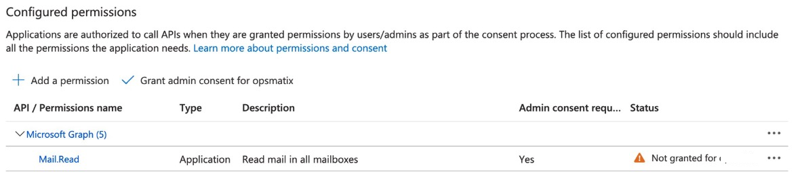

# Setting up Azure AD App with access to MS365 mailboxes

## Instructions

Please find the instructions on how to setup Azure AD app to allow
Inoxis's Microsoft Exchange Online connector to ingest emails
from mailboxes.

1.  Go to [Azure AD
    portal](https://portal.azure.com/#blade/Microsoft_AAD_IAM/ActiveDirectoryMenuBlade/Overview)
    in a browser and sign in.

2.  Go to App registrations and click "New registration"

> 

3.  Enter a name for the app and click register


4.  Once the application registration is successful, please note down
    the Application ID(also called Client ID) and Tenant ID.

> 

5.  Go to Certificates & secrets and click new client secret.


6.  Enter a description, select expiry and click Add.


7.  After saving the client secret, the value of the client secret is
    displayed. Copy this value because you won\'t be able to retrieve
    the key later.


8.  Then go to API permissions and add Mail.Read permission as shown
    below.

    - 
    - 
    - Select "Mail.Read" permission
    - After adding the permission, it would look like below

9.  Once permissions are added, they need to be granted, please use
    "Grant admin consent" as shown below. 

10. After successfully grated the permissions, it will look like below:
    
    
11. App registration is now completed,
    please save the following details securely, they are needed to
    configure the Kafka Connector.

    - Client Id (also called Application Id)
    - Tenent Id
    - Secret Key

12. (**Optional but strongly recommended**) The next step is to restrict
    the app access to specific mailbox. Please use the following link
    for instructions:
    <https://docs.microsoft.com/en-us/graph/auth-limit-mailbox-access>

    1.  At high-level, here are the steps:

    2.  Create a "Mail enabled Security Group", example:
        kafka-connector-access-group@client.com and use it as value for
        PolicyScopeGroupId in the next step.

    3.  Then issue the below command (using Exchange Online Powershell)
        to setup the access policy on the application by replacing the
        values for AppId and PolicyScopeGroupId with correct values.

        ```powershell
        New-ApplicationAccessPolicy -AppId e7e4dbfc-046f-4074-9b3b-2ae8f144f59b -PolicyScopeGroupId kafka-connector-access-group@client.com -AccessRight RestrictAccess -Description "Restrict this app to members of distribution group kafka-connector-access-group."
        ```

    4.  now add the mailboxes intended to be accessed by Kafka Connector to
        the "Mail enabled Security Group" created in step (2)
